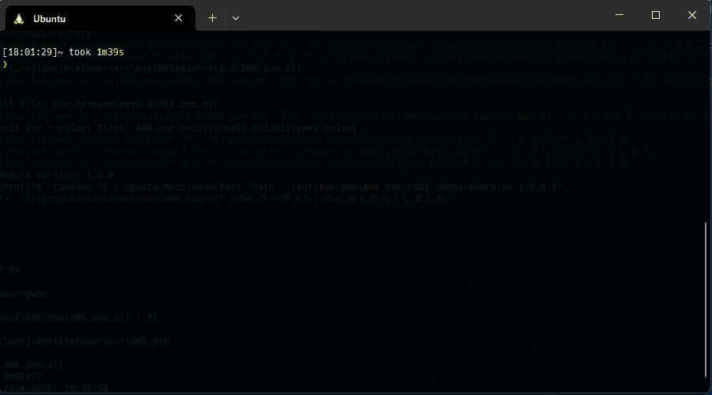

# AWX.psm
PowerShell module to operate AWX/AnsibleTower using Rest API.

## 🚀 Build

See [Build](./docs/en-US/build.md) document.

## ⚙️ Settings

See [Settings](./docs/en-US/settings.md) document.

## 🛠️ Commands

Many commands (over 100) are available.

See [Cmdlet documents(en-US)](./docs/en-US/cmdlets/AWX.psm.md) for all command list.
